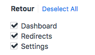
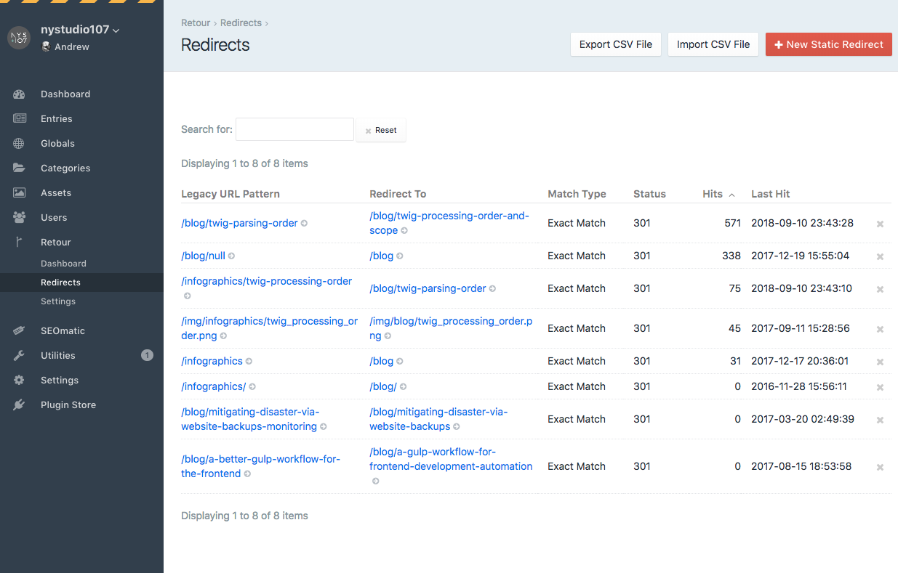
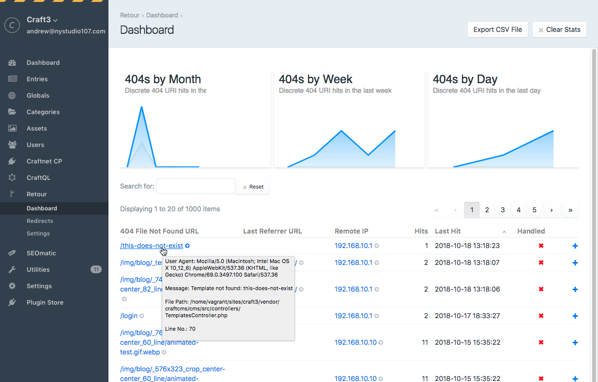
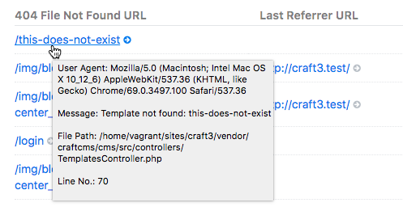
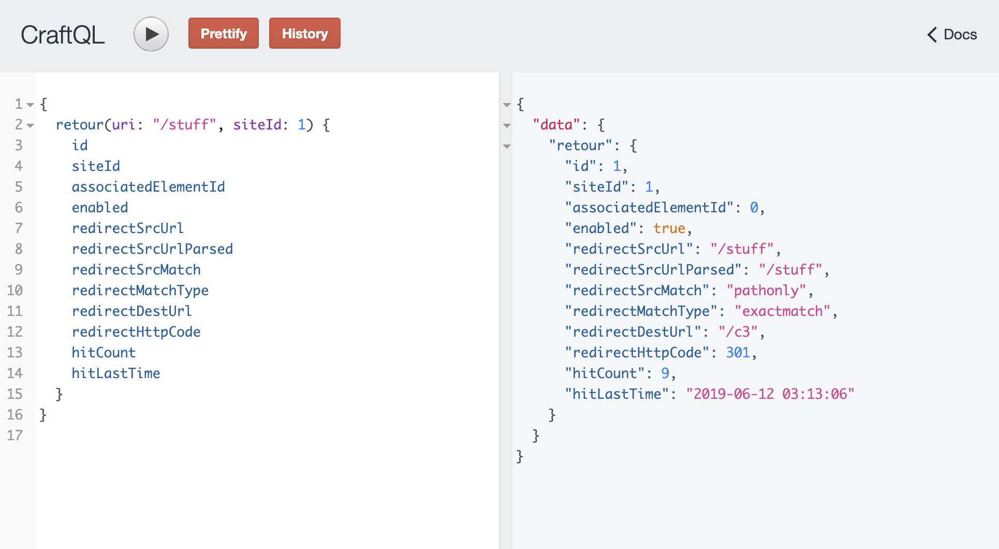

[](https://scrutinizer-ci.com/g/nystudio107/craft-retour/?branch=v3) [](https://scrutinizer-ci.com/g/nystudio107/craft-retour/?branch=v3) [](https://scrutinizer-ci.com/g/nystudio107/craft-retour/build-status/v3) [](https://scrutinizer-ci.com/code-intelligence)

# Retour plugin for Craft CMS 3.x

Retour allows you to intelligently redirect legacy URLs, so that you don't lose SEO value when rebuilding & restructuring a website


Related: [Retour for Craft 2.x](https://github.com/nystudio107/retour)

**Note**: _The license fee for this plugin is $59.00 via the Craft Plugin Store._

### Upgrading from Retour 1.x for Craft CMS 2.x

Even though this version of Retour was entirely rewritten for Craft CMS 3, it was designed to use all of the same data used by the Craft CMS 2.x version of Retour.

So any existing redirects and statistics will continue to be in place.

## Used By


SEOmatic is the redirect tool that the SEO experts at [Moz.com](https://moz.com/) and the creators of Craft CMS, Pixel & Tonic, rely on to handle their website redirects!

## Requirements

This plugin requires Craft CMS 3.0.0 or later.

## Installation

To install the plugin, follow these instructions.

1. Open your terminal and go to your Craft project:

        cd /path/to/project

2. Then tell Composer to load the plugin:

        composer require nystudio107/craft-retour

3. In the Control Panel, go to Settings → Plugins and click the “Install” button for Retour.

You can also install Retour via the **Plugin Store** in the Craft Control Panel.

## Retour Overview

Retour allows you to intelligently redirect legacy URLs, so that you don't lose SEO value when rebuilding & restructuring a website.

In addition to supporting traditional exact and RegEx matching of URL patterns, Retour allows you to have dynamic redirects that have access to the data in your entries when matching URL patterns.

Retour offers true multi-site capability, allowing you to have redirects that affect only certain sites, as well as all sites. Retour will also automatically create a redirect for you if you change an entry's slug, or move an entry around in a Structure.

Unlike other redirect plugins or utilizing `.htaccess` to do redirects, Retour does not add overhead to each request for each redirect you have in place.

Retour is written to be performant. There is no impact on your website's performance until a 404 exception happens; and even then the resulting matching happens with minimal impact.

Don't just rebuild a website. Transition it with Retour.

## Why Use a Plugin for Redirects?

If you have just a few static redirects, then your best bet is to put them in your `.htaccess` file, or better yet, in your `.conf` file for your virtual host.  However, there are a number of cases where using a plugin to handle it is a **better** solution:

1. If you have a large number of redirects, it will slow down every single request your web server handles unnecessarily if they are in `.htaccess` or `.conf`
2. Often the URL patterns from the legacy website do not match the new website URLs in a deterministic way, which makes creating redirects difficult
3. Sometimes you don't have access to the server config files, or you want to give your client the ability to manage redirects easily

Retour solves these problems:

1. Retour only attempts to do a redirect after the web server has already thrown a 404 exception.  Once a redirect mapping is successfully determined, it also caches the result for speedy resolution of the next redirect request.
2. Retour also gives you the ability to do Dynamic Redirects that allow you to import a piece of legacy data into your entries to use as a key for determining the new URL mapping.  In this way, utterly dissimilar URLs can be mapped for redirection effectively.
3. It provides an easy to use GUI that the client can use from Craft's Control Panel, and keeps statistics on the 404 hits (and misses)

### A Word about .htaccess

People using the Apache webserver are familiar with the `.htaccess` file, and may even be using it for redirects.  It's very likely that you should not be using `.htaccess` at all; instead you should disable `.htaccess` via `AllowOverride none` and make your configuration changes in your webserver configuration files.  From [Apache HTTP Server Tutorial: .htaccess files](https://httpd.apache.org/docs/current/howto/htaccess.html)

    There are two main reasons to avoid the use of .htaccess files.

    The first of these is performance. When AllowOverride is set to allow the
    use of .htaccess files, httpd will look in every directory for .htaccess
    files. Thus, permitting .htaccess files causes a performance hit, whether or
    not you actually even use them! Also, the .htaccess file is loaded every
    time a document is requested.

    Further note that httpd must look for .htaccess files in all higher-level
    directories, in order to have a full complement of directives that it must
    apply. (See section on how directives are applied.) Thus, if a file is
    requested out of a directory /www/htdocs/example, httpd must look for the
    following files:

    /.htaccess
    /www/.htaccess
    /www/htdocs/.htaccess
    /www/htdocs/example/.htaccess

    And so, for each file access out of that directory, there are 4 additional
    file-system accesses, even if none of those files are present. (Note that
    this would only be the case if .htaccess files were enabled for /, which is
    not usually the case.)

    In the case of RewriteRule directives, in .htaccess context these regular
    expressions must be re-compiled with every request to the directory, whereas
    in main server configuration context they are compiled once and cached.
    Additionally, the rules themselves are more complicated, as one must work
    around the restrictions that come with per-directory context and
    mod_rewrite. Consult the Rewrite Guide for more detail on this subject.

As you can see, avoiding the use of `.htaccess` completely is best if at all possible, and especially avoid it for `RewriteRule` directives, such as 404 rewrites.

You can read more in the [Stop using .htaccess files! No, really.](https://nystudio107.com/blog/stop-using-htaccess-files-no-really) article.

## Configuring Retour

## Permissions

If you are using Craft CMS "Pro" edition, Retour provides permissions that can be used to grant access to users based on their User Group. These are set in **Settings->Users->User Groups**:



* **Dashboard** - whether the user group has access to view the Retour Dashboard
* **Redirects** - whether the user group has access to viewing and changing Retour Redirects
* **Settings** - whether the user has access to viewing and changing the Retour Settings

You should also grant them the **Access Retour** permission under **General** permissions.

### Static Redirects



The **Retour->Redirects** page lists all of your static redirects. You can sort by any column by clicking on the column name, and you can filter the results by typing in the **Search for:** field.

Clicking on the `x` next to a static redirect will delete it.

The circle status on the left of each redirect indicates whether the redirect is enabled or not

#### Manually Creating Static Redirects

Static Redirects are useful when the Legacy URL Patterns and the new URL patterns are deterministic. You can create them by clicking on **Retour->Redirects** and then clicking on the **New Static Redirect** button.

If you're using Craft to host [multiple sites](https://docs.craftcms.com/v3/sites.html) you can view the redirects for **All Sites** or an individual site using the Sites menu at the top of the page.


* **Enabled** - Should this redirect be processed? Sometimes it is convenient to temporarily disable a redirect rather than outright delete it
* **Sites** - By default, the redirects you create affect **All Sites**. If you're using Craft to host [multiple sites](https://docs.craftcms.com/v3/sites.html) you can also create redirects that only take effect for specific sites
* **Legacy URL Pattern** - Enter the URL pattern that Retour should match.  This matches against the path only (the part of the URL after the domain name), or the full URL, depending on the setting of **Legacy URL Match Type**.  e.g.: Exact Match: `/recipes/` or `http://example.com/recipes/`, or RegEx Match: `.*RecipeID=(.*)`
* **Legacy URL Match Type** - Should the legacy URL be matched by path (e.g. `/new-recipes/`) or by full URL (e.g.: `http://example.com/new-recipes/`)
* **Destination URL** - Enter the destination URL that should be redirected to.  This can either be a fully qualified URL or a relative URL.  e.g.: Exact Match: `/new-recipes/` or `http://example.com/new-recipes/`, or RegEx Match: `/new-recipes/$1`
* **Pattern Match Type** - What type of matching should be done with the Legacy URL Pattern. Details on RegEx matching can be found at [regexr.com](http://regexr.com). If a plugin provides a custom matching function, you can select it here.
* **Redirect Type** - Select whether the redirect should be permanent or temporary.

#### Automatic Slug Redirects

If you rename an Entry's `slug` (or any other Element with URLs), Retour will automatically create a static redirect for you to keep traffic going to the right place.  It will also automatically create a static redirect if you move an entry around in a Structure.

It will appear listed under the "Static Redirects" section like any other static redirect.

The **Create Entry Redirects** setting in **Retour->Settings** allows you to enable or disable this feature.

#### Exporting Redirects to a CSV File

The **Export CSV File** button on the **Retour->Redirects** page allows you to export all of your redirects to a CSV file for external processing or archival purposes.

#### Importing Redirects from a CSV File

Retour allows you to import redirects from a CSV file, with a GUI that allows you to choose how to map the data:


The first row of data in the CSV file should be the headings for the columns.

Choose the fields to import into Retour from the CSV file by dragging them in the appropriate order. Click on the `x` to delete an unused field.

The **Match Type** field must be either `exactmatch` or `regexmatch` (case sensitive). Anything left blank will be filled in with default values.

#### Redirect Loop Prevention

Retour will automatically prevent the creation of a "redirect loop". If you create a new redirect that's destination URL is the same as the source URL of an existing redirect, it will remove the older redirect.

### Settings

The **Retour->Settings** page allows you to configure various site-wide settings for Retour:


* **Plugin name** - The public-facing name of the plugin
* **Create Entry Redirects** - Controls whether Retour automatically creates static redirects when an entry's URI changes.
* **Strip Query String from 404s** - Should the query string be stripped from all 404 URLs before their evaluation?
* **Preserve Query String** - Should the query string be preserved and passed along to the redirected URL?
* **Strip Query String from Statistics** - Should the query string be stripped from the saved statistics source URLs?
* **Record Remote IP** - Should the anonymous ip address of the client causing a 404 be recorded?
* **Statistics to Store** - How many unique 404 statistics should be stored before they are trimmed.
* **Automatically Trim Statistics** - Whether the Statistics should be trimmed after each new statistic is recorded. If you turn this off, statistics will only be trimmed when you visit the Retour Dashboard page in the Control Panel, or you run the `retour/stats/trim` console command (see below).
   
## Using Retour

### Retour Statistics

Retour keeps track of every 404 your website receives.  You can view them by clicking on **Retour->Dashboard**.  



If you're using Craft to host [multiple sites](https://docs.craftcms.com/v3/sites.html) you can view the statistics for **All Sites** or an individual site using the Sites menu at the top of the page.

You can sort by any column by clicking on the column name, and you can filter the results by typing in the **Search for:** field.

Only one record is saved per URL Pattern, so the database won't get clogged with a ton of records.

The charts show you how many directs happened during the last month, week, and day, including how many were handled by Retour.

The **Handled** column will display an `√` if the last 404 hit to this URL was handled by Retour, and an `x` if it was not.

Clicking on the `+` next to an unhandled 404 will create a new Static Redirect with the 404's URL set as the source.



Hovering over the **404 File Not Found URL** will give you more detailed information on the 404 that occurred.

#### Exporting Statistics to a CSV File

The **Export CSV File** button on the **Retour->Statistics** page allows you to export all of your statistics to a CSV file for external processing or archival purposes.

### Retour Widget

If you'd like to see an overview of the Retour Statistics in your dashboard, you can add a Retour widget to your Dashboard:


It displays the total number of handled and not handled 404s, and the 5 most recent 404 URLs in each category right in your dashboard.

### GraphQL Query support

To retrieve Retour redirect data through the [CraftQL](https://github.com/markhuot/craftql) plugin, use the `retour` field in your graphql query.

This is useful if your website is a SPA, and Craft is running "headless", but you still want to give your content authors a way to deal with 404s.

You must as least pass in the URI you want metadata for:

```gql
{
  retour(uri: "/stuff") {
    redirectDestUrl
  }
}
```

...and you can also pass in an optional `siteId`:

```gql
{
  retour(uri: "/stuff", siteId: 1) {
    redirectDestUrl
  }
}
```
Whenever you query Retour via GraphQL, it assumes a 404 has already taken place, and records the statistics for it.

If not redirect can be found to handle the 404, `null` is returned:

```json
{
  "data": {
    "retour": null
  }
}
```

Otherwise the requested data will be returned:
```json
{
  "data": {
    "retour": {
      "redirectDestUrl": "/c3"
    }
  }
}
```


Most of the time, the only thing you'll care about is the `redirectDestUrl`, which is the route that the user should be redirected to. However, you can query for everything:

```gql
{
  retour(uri: "/stuff") {
    id
    siteId
    associatedElementId
    enabled
    redirectSrcUrl
    redirectSrcUrlParsed
    redirectSrcMatch
    redirectMatchType
    redirectDestUrl
    redirectHttpCode
    hitCount
    hitLastTime
  }
}
```

...which results in something like this:
```json
{
  "data": {
    "retour": {
      "id": 1,
      "siteId": 1,
      "associatedElementId": 0,
      "enabled": true,
      "redirectSrcUrl": "/stuff",
      "redirectSrcUrlParsed": "/stuff",
      "redirectSrcMatch": "pathonly",
      "redirectMatchType": "exactmatch",
      "redirectDestUrl": "/c3",
      "redirectHttpCode": 301,
      "hitCount": 12,
      "hitLastTime": "2019-06-12 03:26:42"
    }
  }
}
```

## Developer Info

### Console Command

Retour has a built-in `retour/stats/trim` console command that allows you to manually trim the Statistics database table:

```bash
vagrant@homestead ~/sites/craft3 $ ./craft retour/stats/trim
Trimming statistics
Trimmed 0 from retour_stats table
```

This will trim the `retour_stats` table so that it has only the number of statistics in the table as you've specified via the **Statistics to Store** Setting.

When the `retour_stats` table is trimmed, it sorts the statistics by the **Last Hit** time, and only trims the oldest statistics.

Normally this is done automatically when a new statistic is recored, but for high traffic sites that are constantly hit by bots, you might want to do it manually at regular intervals.

You can also pass in an optional `--limit` to override the **Statistics to Store** Setting, and trim to a specified number of statistics:

```bash
vagrant@homestead ~/sites/craft3 $ ./craft retour/stats/trim --limit=1
Trimming statistics
Trimmed 2 from retour_stats table
```

### Utility Functions

`craft.retour.getHttpStatus` in your templates will return the HTTP Status code for the current template, so you can display a special message for people who end up on a page via a `301` or `302` redirect.

### Resolve Redirect Events

Retour throws several Resolve Redirect events, in case you want to listen for them in your custom plugin/module, or use them in conjunction with the [Webhooks](https://github.com/craftcms/webhooks) plugin.

`beforeResolveRedirect` The event that is triggered before Retour has attempted to resolve redirects. You may set [[ResolveRedirectEvent::redirectDestUrl]] to the URL that it should redirect to, or null if no redirect should happen:
     
```php
use nystudio107\retour\services\Redirects;
use nystudio107\retour\events\ResolveRedirectEvent;

Event::on(Redirects::class,
    Redirects::EVENT_AFTER_SAVE_REDIRECT,
    function(ResolveRedirectEvent $event) {
        // potentially set $event->redirectDestUrl;
    }
);
```

`afterResolveRedirect` The event that is triggered after Retour has attempted to resolve redirects. You may set [[ResolveRedirectEvent::redirectDestUrl]] to the URL that it should redirect to, or null if no redirect should happen:

```php
use nystudio107\retour\services\Redirects;
use nystudio107\retour\events\ResolveRedirectEvent;

Event::on(Redirects::class,
    Redirects::EVENT_AFTER_RESOLVE_REDIRECT,
    function(ResolveRedirectEvent $event) {
        // potentially set $event->redirectDestUrl;
    }
);
```

The `ResolveRedirectEvent` has the following read-only properties that you can use to attempt to match purposes:

```php
    /**
     * @var string The full URL including hostname & protocol of the 404'd request
     */
    public $fullUrl;

    /**
     * @var string The path of the 404'd request
     */
    public $pathOnly;

```

The `ResolveRedirectEvent` has the following properties that you can set:

```php
    /**
     * @var null|string The URL that should be redirected to or null if no redirect
     *                  should take place
     */
    public $redirectDestUrl = null;

    /**
     * @var int The http status code for this redirect; see https://httpstatuses.com/
     */
    public $redirectHttpCode = 301;
```

If your plugin/module wishes to cause a redirect, it should set the `$redirectDestUrl` property to the URL it wants to redirect to.

### Redirect Events

Retour throws several Redirect events, in case you want to listen for them in your custom plugin/module, or use them in conjunction with the [Webhooks](https://github.com/craftcms/webhooks) plugin.

`beforeSaveRedirect` is the event that is triggered before the redirect is saved. You may set [[RedirectEvent::isValid]] to `false` to prevent the redirect from getting saved:

```php
use nystudio107\retour\services\Redirects;
use nystudio107\retour\events\RedirectEvent;

Event::on(Redirects::class,
     Redirects::EVENT_BEFORE_SAVE_REDIRECT,
     function(RedirectEvent $event) {
         // potentially set $event->isValid;
     }
 );
```

`afterSaveRedirect` is the event that is triggered after the redirect is saved.

```php
use nystudio107\retour\services\Redirects;
use nystudio107\retour\events\RedirectEvent;

Event::on(Redirects::class,
     Redirects::EVENT_AFTER_SAVE_REDIRECT,
     function(RedirectEvent $event) {
         // the redirect was saved
     }
 );
```

The `RedirectEvent` has the following read-only properties that you can use for informational purposes:
```php
    /**
     * @var bool Whether the redirect is brand new
     */
    public $isNew = false;

    /**
     * @var string The old URL
     */
    public $legacyUrl;

    /**
     * @var string The new URL
     */
    public $destinationUrl;

    /**
     * @var string The type of matching done on the legacyUrl
     */
    public $matchType;

    /**
     * @var string The type of redirect
     */
    public $redirectType;
```

### Custom Match Functions via Plugin

The patterns mentioned below still work, but are deprecated. It's recommend that you use the **Resolve Redirect Events** mentioned above.

Retour allows you to implement a custom matching function via plugin, if the Exact and RegEx matching are not sufficient for your purposes.

In your main plugin class file, simply add this function:

    /**
     * retourMatch gives your plugin a chance to use whatever custom logic is needed for URL redirection.  You are passed
     * in an array that contains the details of the redirect.  Do whatever matching logic, then return true if is a
     * matched, false if it is not.
     *
     * You can alter the 'redirectDestUrl' to change what URL they should be redirected to, as well as the 'redirectHttpCode'
     * to change the type of redirect.  None of the changes made are saved in the database.
     *
     * @param mixed An array of arguments that define the redirect
     *            $args = array(
     *                'redirect' => array(
     *                    'id' => the id of the redirect record in the retour_redirects table
     *                    'associatedElementId' => the id of the entry if this is a Dynamic Entry Redirect; 0 otherwise
     *                    'redirectSrcUrl' => the legacy URL as entered by the user
     *                    'redirectSrcUrlParsed' => the redirectSrcUrl after it has been parsed as a micro template for {variables}
     *                        via renderObjectTemplate().  This is typically what you would want to match against.
     *                    'redirectMatchType' => the type of match; this will be set to your plugin's ClassHandle
     *                    'redirectDestUrl' => the destination URL for the entry this redirect is associated with, or the
     *                        destination URL that was manually entered by the user
     *                    'redirectHttpCode' => the redirect HTTP code (typically 301 or 302)
     *                    'hitCount' => the number of times this redirect has been matched, and the redirect done in the browser
     *                    'hitLastTime' => the date and time of the when this redirect was matched
     *                    'locale' => the locale of this redirect
     *                )
     *            );
     * @return bool Return true if it's a match, false otherwise
     */
    public function retourMatch($args)
    {
        return true;
    }

Your plugin will then appear in the list of Pattern Match Types that can be chosen from via **Retour->Redirects**.

## Retour Roadmap

Some things to do, and ideas for potential features:

* Release it

Brought to you by [nystudio107](https://nystudio107.com/)
