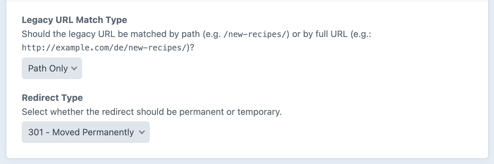
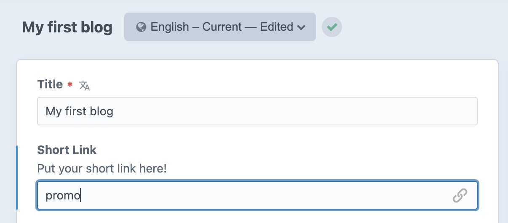
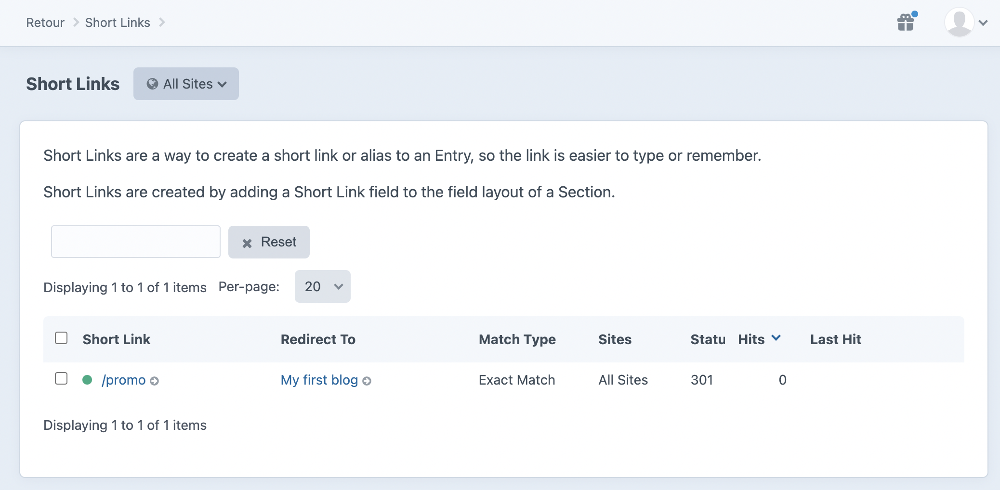

# Short Links

Short Links are a way to create a short link or alias to an Entry, so the link is easier to type or remember.

They are redirects under the hood, but are presented in a simplified interface to make it easier for content authors to work with.

## Short Link field

To create short links, you'll need to create a Short Link field, and add it to the field layout of a Section.

There are also field settings that let you choose how the short link should function (analogous to regular redirect settings):

You can name the field whatever you like, and provide a description that is appropriate for your content authors.

Then the field will appear in your entries, just like any Craft field:

When the entry is saved, a redirect will automtically be created
that redirects from the short link the content authors provide, to the entry.

In the above example, anyone visiting `https://example.com/promo` will be redirected to `https://example.com/my-first-blog`.

If a short link field is left blank, the corresponding redirect will be deleted.

For multi-site setups, if you want different short links for each site, ensure you set the field propagation appropriately.

## Short Links page

Short links can also be managed in a separate **Short Links** pane in the Retour sidebar:

They can be searched, sorted, etc. just like regular redirects can.

There is a separate User permission to allow users access to the **Short Links** pane.

Short links will not appear in the **Redirects** pane, but any hits to them are recorded in the **Dashboard** pane.

Brought to you by [nystudio107](https://nystudio107.com/)
